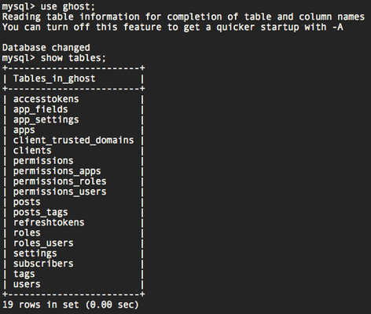

## CentOS 7 修改主机名

### 方法 1: `hostname 主机名`

这种方式，只能修改临时的主机名，当重启机器后，主机名称又变回来了。

### 方法 2: `hostnamectl set-hostname <主机名>`

使用这种方式修改，可以永久性的修改主机名称！


所以我们的步骤应该：

1. 测试备份命令是否可以正常执行
2. 安装测试命令行邮件工具 mailx
3. 安装计划任务工具 Crontab
4. 编写备份脚本
5. 添加计划任务

#### 测试备份命令

首先你要获得你要备份的数据库对应的 select 权限，仅需要 select 权限即可，mysql 在管理方面，应该坚持只赋予必须权限的原则。

```mysql
mysql> grant select on ghost.* to 'ghost_backuser'@'localhost' identified by 'backupPass';
Query OK, 0 rows affected (0.00 sec)
```

因为我只在本地执行备份操作，所以我只赋予了`localhost`的权限，你的权限应该要是执行备份工作的服务器主机信息。

```mysql
# 创建仅授权本地访问的用户
mysql> create user dbackuser@'localhost';
# 创建授权所有来源地址的用户
mysql> create user dbackuser@'%';
# 创建仅授权从特定IP的用户
mysql> create user dbackuser@'192.168.0.230';
# 创建仅授权从特定IP段访问的用户
mysql> create user dbackuser@'192.168.0.0/23';
# 创建仅授权从特定域名来访问的用户
mysql> create user dbackuser@'samzong.me';
```

好了，接下来我们测试对应用户是否有权限。

```mysql
➜  ~ mysql -u ghost_backuser -pbackupPass
Warning: Using a password on the command line interface can be insecure.
Welcome to the MySQL monitor.  Commands end with ; or \g.
Your MySQL connection id is 7
Server version: 5.6.35 MySQL Community Server (GPL)

Copyright (c) 2000, 2016, Oracle and/or its affiliates. All rights reserved.

Oracle is a registered trademark of Oracle Corporation and/or its
affiliates. Other names may be trademarks of their respective
owners.

Type 'help;' or '\h' for help. Type '\c' to clear the current input statement.

mysql> show databases;
+--------------------+
| Database           |
+--------------------+
| information_schema |
| ghost              |
+--------------------+
2 rows in set (0.00 sec)

mysql> use ghost;
Reading table information for completion of table and column names
You can turn off this feature to get a quicker startup with -A

Database changed

mysql> select name from users;
+------+
| name |
+------+
| ALEX |
+------+
1 row in set (0.00 sec)
```

测试`mysqldump`备份命令，注意 mysqldump 备份会锁表，但对于正在工作的数据库，锁表会影响到正常业务，所以我们可以使用`--single-transaction`参数，不锁表备份。

```bash
➜  ~ mysqldump -u ghost_backuser -pbackupPass ghost > ghost.bak.sql
Warning: Using a password on the command line interface can be insecure.
mysqldump: Got error: 1044: Access denied for user 'ghost_backuser'@'localhost' to database 'ghost' when using LOCK TABLES
➜  ~ mysqldump -u ghost_backuser -pbackupPass --single-transaction ghost > ghost.bak.sql
Warning: Using a password on the command line interface can be insecure.
➜  ~ ls -lh
total 780K
-rw-r--r-- 1 root   root  780K May 17 16:24 ghost.bak.sql
➜  ~
```

#### 安装命令行邮件工具 mailx

安装 mailx 在 CentOS/RehHat:

```bash
➜  ~ yum install -y mailx
```

测试发送邮件：

```bash
➜  ~ echo "test" | mail -s "this a test email" samzong.lu@gmail.com
```


#### 安装计划任务工具 Crontab

crontab 命令常见于 Unix 和类 Unix 的操作系统之中，用于设置周期性被执行的指令。该命令从标准输入设备读取指令，并将其存放于“crontab”文件中。通常，crontab 储存的指令被守护进程激活，crond 常常在后台运行，每一分钟检查是否有预定的作业需要执行。这类作业一般称为 cron jobs。

```bash
➜  ~ yum install vixie-cron
➜  ~ yum install crontabs
```

> vixie-cron 软件包是 cron 的主程序；
>
> crontabs 软件包是用来安装、卸装、或列举用来驱动 cron 守护进程的表格的程序。

启动 crond 并设置为开机自启动：

```bash
➜  ~ service crond start
Starting crond:                                            [  OK  ]
➜  ~ chkconfig crond on
```

crontab 基础命令：

```bash
语　　法：crontab [-u <用户名称>][配置文件] 或 crontab [-u <用户名称>][-elr]

补充说明：cron是一个常驻服务，它提供计时器的功能，让用户在特定的时间得以执行预设的指令或程序。只要用户会编辑计时器的配置文件，就可以使用计时器的功能。

配置文件格式：Minute Hour Day Month DayOFWeek Command

参　　数：
-e 　编辑该用户的计时器设置。
-l 　列出该用户的计时器设置。
-r 　删除该用户的计时器设置。
-u<用户名称> 　指定要设定计时器的用户名称。
```

crontab 配置的基本格式：

```bash
*     * 　 *　  *　  *　　command
分　  时　 日　 月　 周　  命令

 第1列表示分钟1～59 每分钟用*或者 */1表示
 第2列表示小时1～23（0表示0点）
 第3列表示日期1～31
 第4列表示月份1～12
 第5列标识号星期0～6（0表示星期天）
 第6列要运行的命令
```

crontab 的一些例子：

```bash
#每晚的21:30 重启apache
30 21 * * * /usr/local/etc/rc.d/lighttpd restart

#每月1、10、22日的4 : 45重启apache
45 4 1,10,22 * * /usr/local/etc/rc.d/lighttpd restart

#每周六、周日的1 : 10重启apache
10 1 * * 6,0 /usr/local/etc/rc.d/lighttpd restart

#每天18 : 00至23 : 00之间每隔30分钟重启apache
0,30 18-23 * * * /usr/local/etc/rc.d/lighttpd restart

#每星期六的11 : 00 pm重启apache
0 23 * * 6 /usr/local/etc/rc.d/lighttpd restart

#晚上11点到早上7点之间，每隔一小时重启apache
* 23-7/1 * * * /usr/local/etc/rc.d/lighttpd restart

#每一小时重启apache
* */1 * * * /usr/local/etc/rc.d/lighttpd restart

#每月的4号与每周一到周三的11点重启apache
0 11 4 * mon-wed /usr/local/etc/rc.d/lighttpd restart

#一月一号的4点重启apache
0 4 1 jan * /usr/local/etc/rc.d/lighttpd restart

#每半小时同步一下时间
*/30 * * * * /usr/sbin/ntpdate 210.72.145.44
```

#### 编写备份脚本

好了，以上我们测试需要用到的各个模块，下面我们要编写备份脚本：

```bash
#!/bin/bash
#  mysqldump scripts.
# filepath: /usr/local/bin/ghost_sqldump.sh
# Author: samzong

#  set TIME variable
TIME=`date "+%Y%m%d%H%M%S"`

# backup db ghost to /mysqlbak/
mysqldump --single-transaction -h localhost -u ghost_backuser -pbackupPass ghost  > /mysqlbak/ghost_$TIME.sql

# tar sql files.
tar czvf /mysqlbak/ghost_$TIME.sql.tgz /mysqlbak/ghost_$TIME.sql --remove-files

# remove over 7 days sql files.
find /mysqlbak/ -mtime +7 -exec rm -f {} \;

# send mial to admin'mial
if [ $? -eq 0 ]
then
 echo "ghost SQL dump is successfully. At time: `date` " | mail -s ghost-dump-successfully  samzong.lu@gmail.com
else
 echo " Error Error ghost SQL dump is Error. At time: `date` " | mail -s ghost-dump-error samzong.lu@gmail.com
fi
```

注意脚本中的以下内容要根据你的实际情况修改：

* -h " "  这是数据库所在的主机
* -u " "       这是数据库可备份的用户名
* -p" "        备份用户的密码

#### 添加计划任务

经过以上测试，已经很好的完成备份脚本，接下来将脚本添加到 crontab 内，并设置自动执行的时间：

```bash
➜  ~ crontab -e
00 00 * * * sh /usr/local/bin/ghost_sqldump.sh
```

重启 crontab 服务，并确认 crontab 已经设置为开机自启动

```bash
➜  ~ service crond restart
Stopping crond:                                            [  OK  ]
Starting crond:                                            [  OK  ]
➜  ~ chkconfig --list | grep crond
crond           0:off 1:off 2:on 3:on 4:on 5:on 6:off
```
