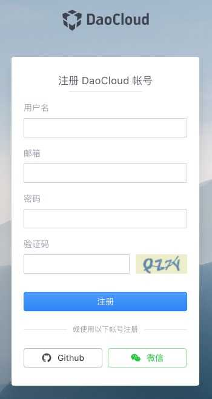
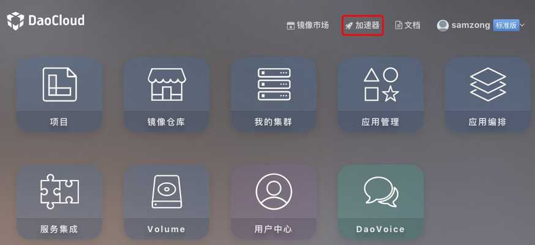
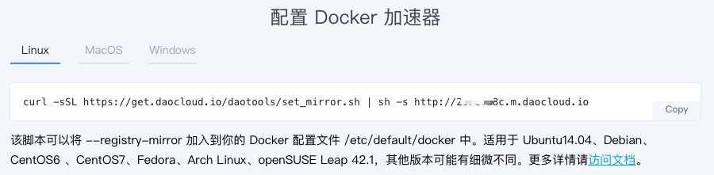

因为 Docker Hub 没有在国内部署站点或者增加了国内的 CDN，这导致国内的开发者在使用 docker pull 获取 images 的时候速度非常的慢，甚至于因为网络的原因会失败。

但是 Docker Hub 有着非常丰富的镜像资源，所以我这一直是个问题困扰着我，一次偶然机会发现了[DaoCloud](https://www.daocloud.io)提供了国内镜像加速服务，并且提供的 Docker Hub Mirror 详细的文档。

#### 1. 注册 DaoCloud 账号

首先，你需要到一 DaoCloud 账号，注册很方便，点击地址：[signup](https://account.daocloud.io/signup)

#### 2. 登录到你的 DaoCloud 账号内，然后入下图操作

#### 3. 查看你的 DaoCloud 加速器地址

[链接](https://www.daocloud.io/mirror#accelerator-doc)

选择你相对应平台的的加速器设置

