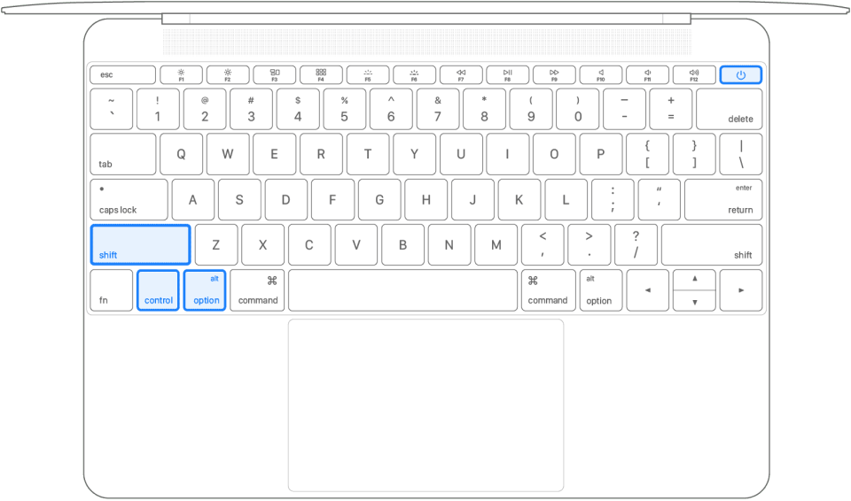

:::warning

`M 系列芯片`的 MacBook 不具备 `SMC` 功能，以前由芯片控制的功能都嵌入到处理器内，重启电脑即可达到重置 `SMC` 的效果。

> 根据经验，关闭 MacBook 至少 30 秒后再开机，可以达到重置 SMC 的效果。

:::

MacBookPro 雷电口不可用了不着送修，尝试下一下方法；可以为您省下大几千块钱哟 ~

## 什么是 SMC？

SMC 全称 系统管理控制器负责管理与以下功能相关的行为：

- 电源，包括电源按钮和 USB 端口的电源
- 电池和充电
- 风扇和其他热能管理功能
- 指示灯或感应器，例如状态指示灯（睡眠状态、电池充电状态等）、突发移动感应器、环境光传感器和键盘背光
- 打开和合上笔记本电脑盖时的行为

------

## SMC 常见问题

由于 Mac 的雷电接口经常需要插拔外接设备，而外接设备的接口电流电压不一致，Mac 在遇到异常电涌时会触发  SMC 的自我保护机制，通常意义是雷电口不可用。

通过重置系统管理控制器 (SMC) 可以解决某些与电源、电池、风扇和其他功能相关的问题。

------

## 注意事项

新款 Apple M1 设备的重置步骤本文不一致，后续会补充更新

------

## 配备 T2 芯片的笔记本电脑

- 将 Mac 关机
- 在内建键盘上，按住以下所有按键。Mac 可能会开机。
  - 键盘左侧的 **Control** 
  - 键盘左侧的 **Option** (Alt) 
  - 键盘右侧的 **Shift** 

- 按住**全部三个按键** 7 秒钟，然后在不松开按键的情况下按住**电源按钮**。如果 Mac 处于开机状态，它将在您按住这些按键时关机。

- 继续按住**全部四个按键** 7 秒钟，然后松开这些按键。
- 等待几秒钟，然后按下**电源按钮**以将 Mac 开机。

------

## 配备 T2 芯片的台式电脑

1. 将 Mac 关机，然后拔下电源线。
2. 等待 15 秒钟，然后重新接回电源线。
3. 等待 5 秒钟，然后按下**电源按钮**以将 Mac 开机。

------

## 在其他电脑上重置 SMC

如果您的 Mac 没有配备 Apple T2 安全芯片，请按照以下步骤操作。

### 装有不可拆卸电池的笔记本电脑

这类电脑包括 2009 年中至 2017 年推出的 MacBook Pro 机型、2017 年或之前推出的 MacBook Air 机型，以及所有 MacBook 机型，但 MacBook（13 英寸，2009 年中）除外。

1. 将 Mac 关机。
2. 在内建键盘上，按住以下所有按键：

- 键盘左侧的 **Shift** 
- 键盘左侧的 **Control** 
- 键盘左侧的 **Option** (Alt) 

- 在按住**全部三个按键**的情况下，按住**电源按钮**。

- 按住**全部四个按键** 10 秒钟。
- 松开所有按键，然后按下**电源按钮**以将 Mac 开机。

### 装有可拆卸电池的笔记本电脑

这类电脑包括 2009 年初或之前推出的所有 MacBook Pro 和 MacBook 机型，以及 MacBook（13 英寸，2009 年中）。

1. 将 Mac 关机。
2. 拆下电池。
3. 按住**电源按钮** 5 秒钟。
4. 重新安装电池。
5. 按下**电源按钮**以将 Mac 开机。

### 台式电脑

1. 将 Mac 关机，然后拔下电源线。
2. 等待 15 秒钟，然后重新接回电源线。
3. 等待 5 秒钟，然后按下**电源按钮**以将 Mac 开机。
