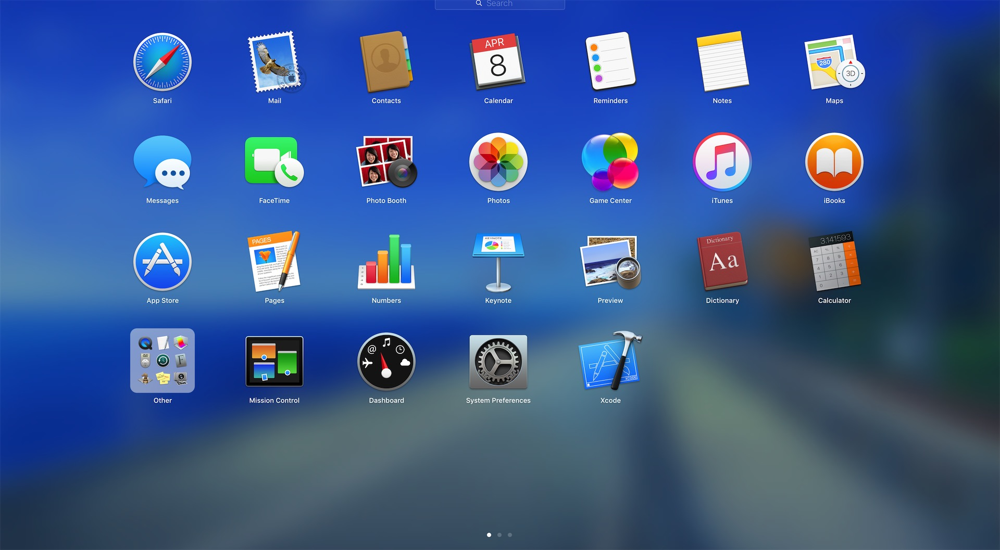
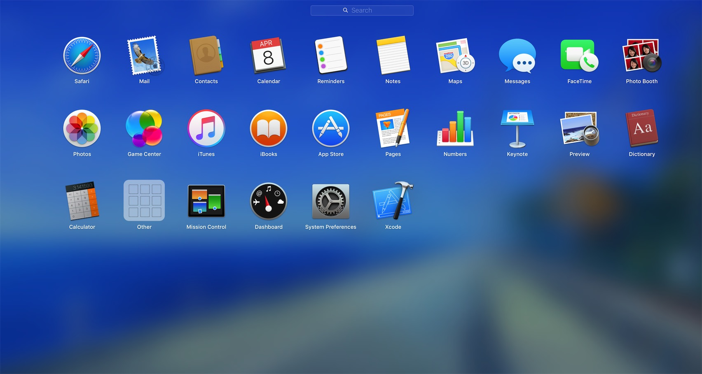

# Mac 调整Launchpad图标大小

很多人觉得默认 Launchpad 的应用程序图标很大, 空间比较拥挤, 不过这个其实是可以通过调整 Launchpad 每一行和每一列图标的数量, 来调整 Launchpad 图标大小.

默认如下图：  


代码块:

```
# 调整每一行显示数量为8个。
➜ defaults write com.apple.dock springboard-columns -int 10

＃ 重启Launchpad
➜ defaults write com.apple.dock ResetLaunchPad -bool TRUE;killall Dock
```

修改后如下：  
