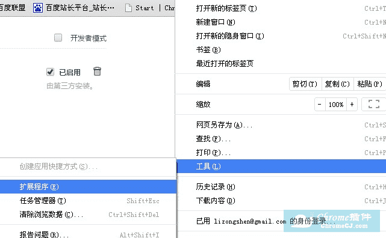
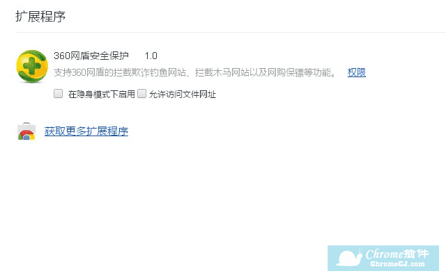
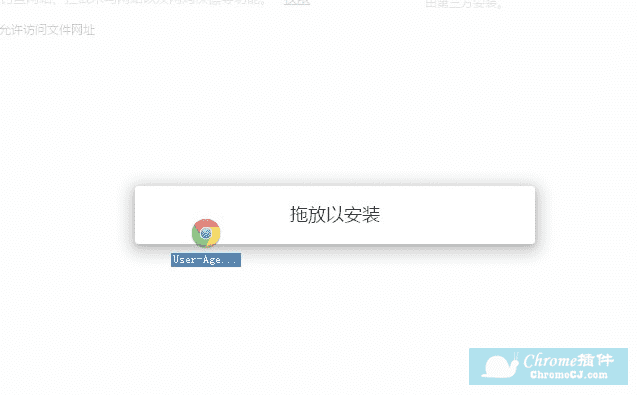
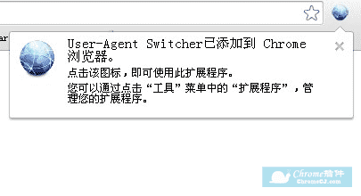

下载插件：[immpkjjlgappgfkkfieppnmlhakdmaab\_v0.9.8.74.zip](https://www.yuque.com/attachments/yuque/0/2021/zip/343806/1626953566160-f0ac0382-2820-497b-ac94-4d45bf856ab6.zip?_lake_card=%7B%22src%22%3A%22https%3A%2F%2Fwww.yuque.com%2Fattachments%2Fyuque%2F0%2F2021%2Fzip%2F343806%2F1626953566160-f0ac0382-2820-497b-ac94-4d45bf856ab6.zip%22%2C%22name%22%3A%22immpkjjlgappgfkkfieppnmlhakdmaab_v0.9.8.74.zip%22%2C%22size%22%3A149152%2C%22type%22%3A%22application%2Fzip%22%2C%22ext%22%3A%22zip%22%2C%22status%22%3A%22done%22%2C%22taskId%22%3A%22uc49f92d7-8f44-47ac-9838-e24bd41e27c%22%2C%22taskType%22%3A%22upload%22%2C%22id%22%3A%22u573c41c9%22%2C%22card%22%3A%22file%22%7D)

首先用户点击谷歌浏览器右上角的自定义及控制按钮，在下拉框中选择工具选项，然后点击扩展程序来启动 Chrome 浏览器的扩展管理器页面。

在打开的谷歌浏览器的扩展管理器中用户可以看到一些已经安装程序的 Chrome 插件，或者一个 Chrome 插件也没有。

找到自己已经下载好的 Chrome 离线安装文件 xxx.crx，然后将其从资源管理器中拖动到 Chrome 的扩展管理界面中，这时候用户会发现在扩展管理器的中央部分中会多出一个”拖动以安装“的插件按钮。

松开鼠标就可以把当前正在拖动的插件安装到谷歌浏览器中去，但是谷歌考虑用户的安全隐私，在用户松开鼠标后还会给予用户一个确认安装的提示。

用户这时候只需要点击添加按钮就可以把该离线 Chrome 插件安装到谷歌浏览器中去，安装成功以后该插件会立即显示在浏览器右上角（如果有插件按钮的话），如果没有插件按钮的话，用户还可以通过 Chrome 扩展管理器找到已经安装的插件。

用户只需要通过上面介绍的五个步骤就可以轻松地把离线谷歌浏览器插件安装到 Chrome 中去，希望这个离线 Chrome 插件的安装方法能够帮助到您或者是您的朋友。

> 出处 [https://huajiakeji.com/utilities/2014-09/181.html](https://huajiakeji.com/utilities/2014-09/181.html)
