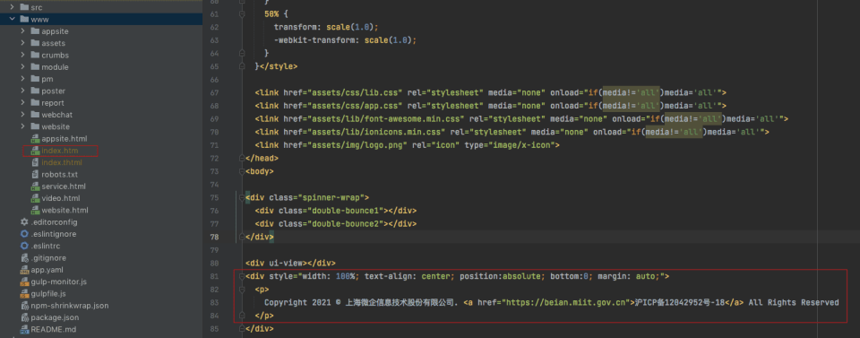
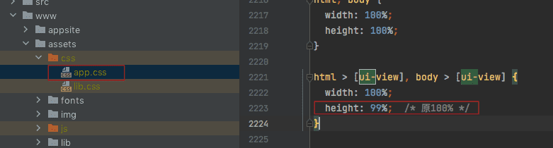

`REGEXP` 在 MySQL 中使用的正则表达式标识符，有着非常丰富的使用路径，代替`like`将有非常大的使用空间

## 强制增加定位域名备案

> 增加域名备案到页脚

```html
<div style="width: 100%; text-align: center; position:absolute; bottom:0; margin: auto;">
   
       Copyright 2021 © 上海微企信息技术股份有限公司。<a href="https://beian.miit.gov.cn">沪 ICP 备 12042952 号 -18`  All Rights Reserved
   
</div>
```



> 修改页面 height 默认展示底部 footer

```css
body,body>[ui-view],html,html>[ui-view] {
    width: 100%;
    height: 99%  # 原100%
}
```


