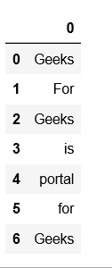
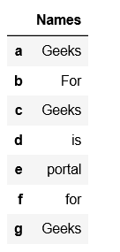
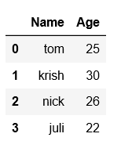

```python
import pandas as pd
  
# list of strings
lst = ['Geeks', 'For', 'Geeks', 'is', 
            'portal', 'for', 'Geeks']
  
# Calling DataFrame constructor on list
df = pd.DataFrame(lst)
```



```python
# import pandas as pd
import pandas as pd

# list of strings
lst = ['Geeks', 'For', 'Geeks', 'is', 'portal', 'for', 'Geeks']

# Calling DataFrame constructor on list
# with indices and columns specified
df = pd.DataFrame(lst, index =['a', 'b', 'c', 'd', 'e', 'f', 'g'],
           columns =['Names'])
```



```python
# Creating DataFrame using multi-dimensional list

import pandas as pd
 
# List1
lst = [['tom', 25], ['krish', 30],
 ['nick', 26], ['juli', 22]]
 
df = pd.DataFrame(lst, columns =['Name', 'Age'])
```



```python
# Using multi-dimensional list with column name and dtype specified.
import pandas as pd
 
# List1
lst = [['tom', 'reacher', 25], ['krish', 'pete', 30],
 ['nick', 'wilson', 26], ['juli', 'williams', 22]]
 
df = pd.DataFrame(lst, columns =['FName', 'LName', 'Age'], dtype = float)
```
