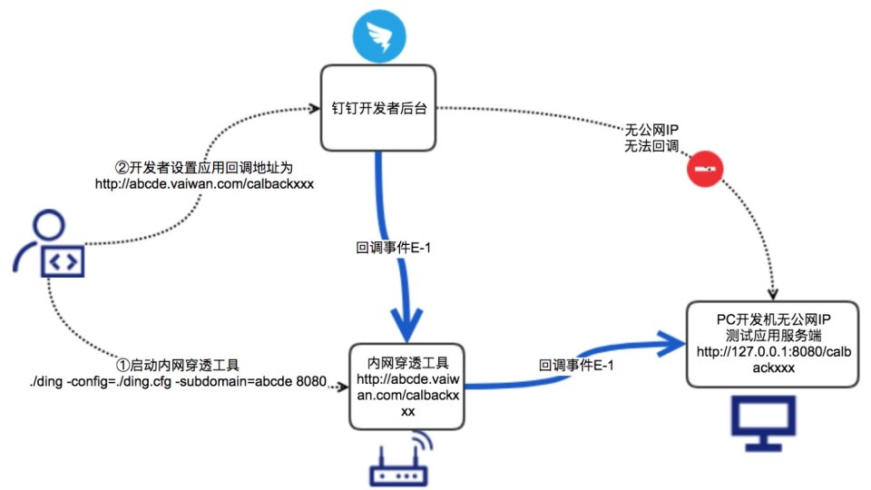
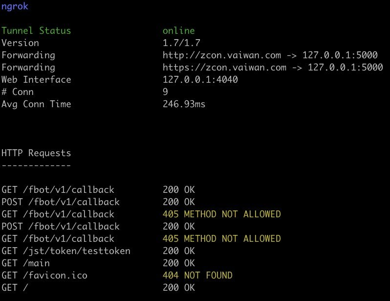
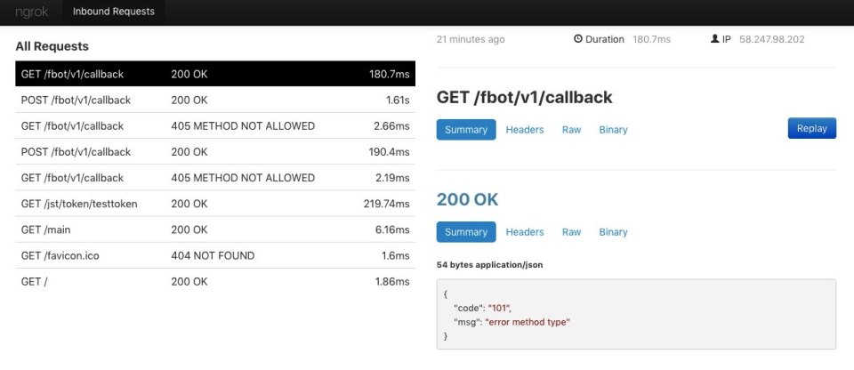

> [https://developers.dingtalk.com/document/resourcedownload/http-intranet-penetration?pnamespace=tutorial](https://developers.dingtalk.com/document/resourcedownload/http-intranet-penetration?pnamespace=tutorial)



## 使用方法

```python

git clone https://github.com/open-dingtalk/pierced.git

cd  pierced/mac_64
./ding -config=./ding.cfg -subdomain=abcde 5000

# usage:  命令 -config=配置文件 [不需要修改] -subdomain=项目域名 Port
# 代理主域名是 abcde.vaiwan.com 暴露的域名就是 subdomain.vaiwan.com
```

通过以上命令：会将本地端口为 5000 代理到 公网域名 abcde.vaiwan.com；启动成功后会展示如下页面，并会打印出对应的请求记录



## 调试辅助

在运行成功后，会看到一个 `Web Interface` 运行在本地 `http://127.0.0.1:4040` 这是一个非常友好的调试界面，可以让你这边看到每个请求的日志信息



细心的话，你也可以注意到，在每个接口的页面上的右侧有个 `Retry` 的按钮，这个是可以方便我们对接口进行重试

## 结语

同时支持 MacOS/Windows 使用的前置成本上，要比花生壳的内网穿透简单很多；我主要使用在开发钉钉 bot 阶段，大大减少的发布到服务端和查看日志的时间；感谢钉钉团队提供了这么友好的工具
