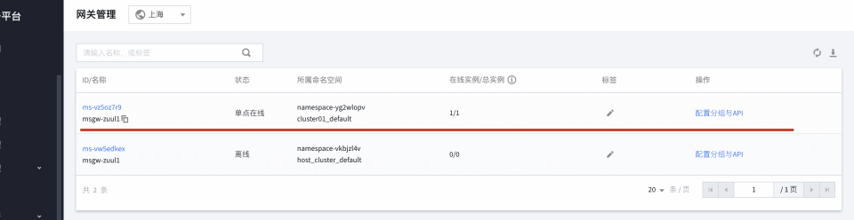
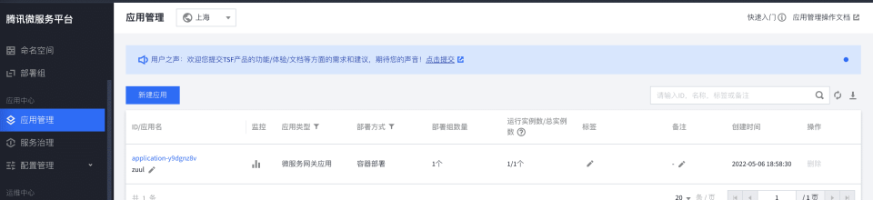
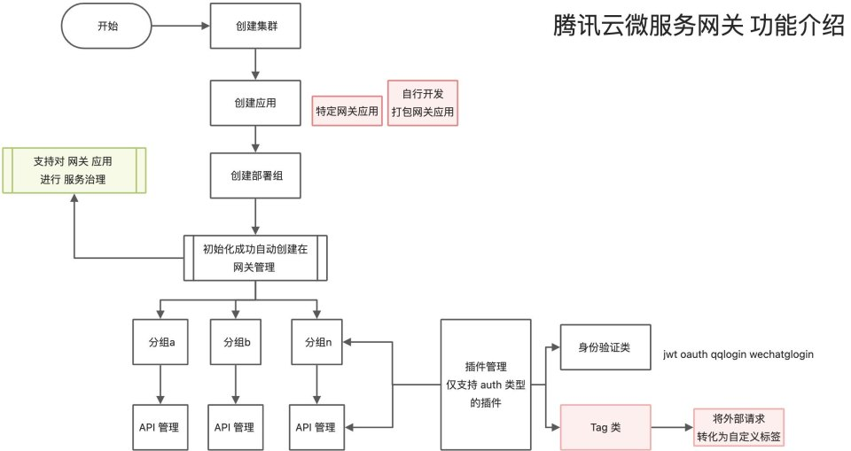
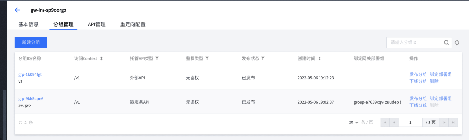
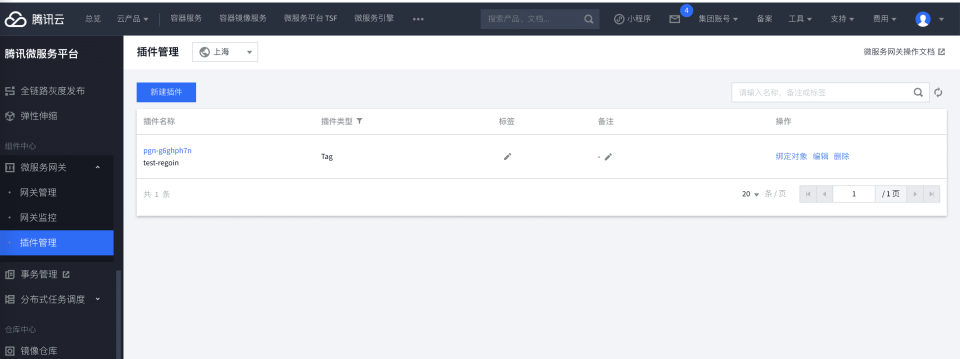
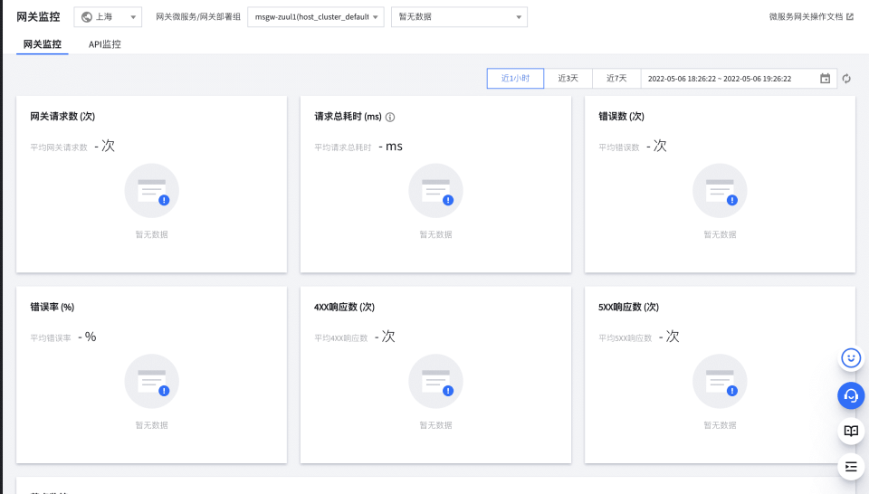
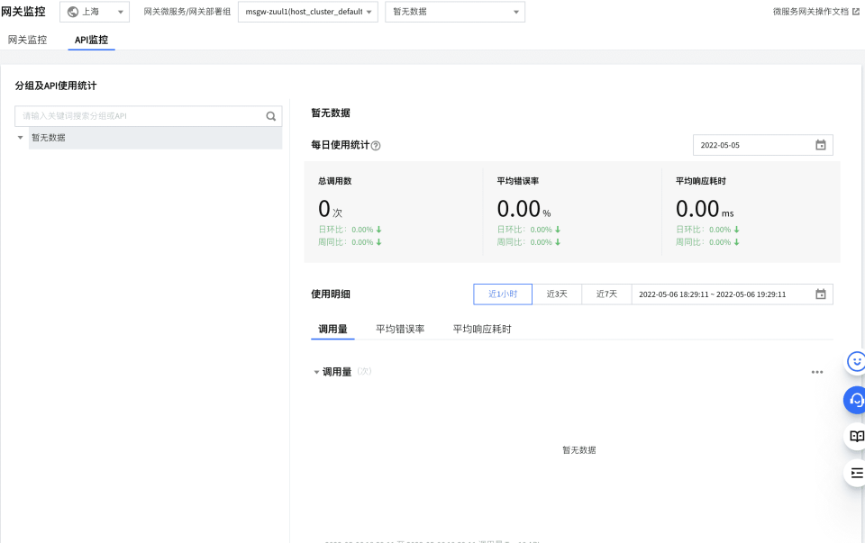

## 网关管理

默认这里展示对应的网关列表，未提供网关的创建入口，需要依赖前序的网关应用创建；

## 

:::warning
在 微服务的应用中心 进行网关创建
:::

### 网关的创建过程

### 网关绑定的分组管理

一个网关下可以创建多个分组，分别指向不同的 托管 API，根据访问的 Context 区分

### 分组下的 API 管理

- API 类型为：微服务 API，支持检测自动导入 API；也支持手工编辑
- API 类型为：外部 API，仅支持支持手工编辑

## 插件管理

- 主要支持 2 类型 插件：
  - Auth
  - 转义 Tag `<特色>`

## 网关监控

监控部分均是自研，实现的内容也比较简单

### 基于网关的监控

### 基于 API 的统计监控

## 录屏存放处

> 仅 DaoCloud 可查看

[https://yongyu2000hotmailcom.sharepoint.cn/:f:/s/ndx/Emsrgwa4Z7xMsT4P8GMd31IB5p1zTy__gNKWn10_ynvvIQ?e=GFNejD](https://yongyu2000hotmailcom.sharepoint.cn/:f:/s/ndx/Emsrgwa4Z7xMsT4P8GMd31IB5p1zTy__gNKWn10_ynvvIQ?e=GFNejD)
