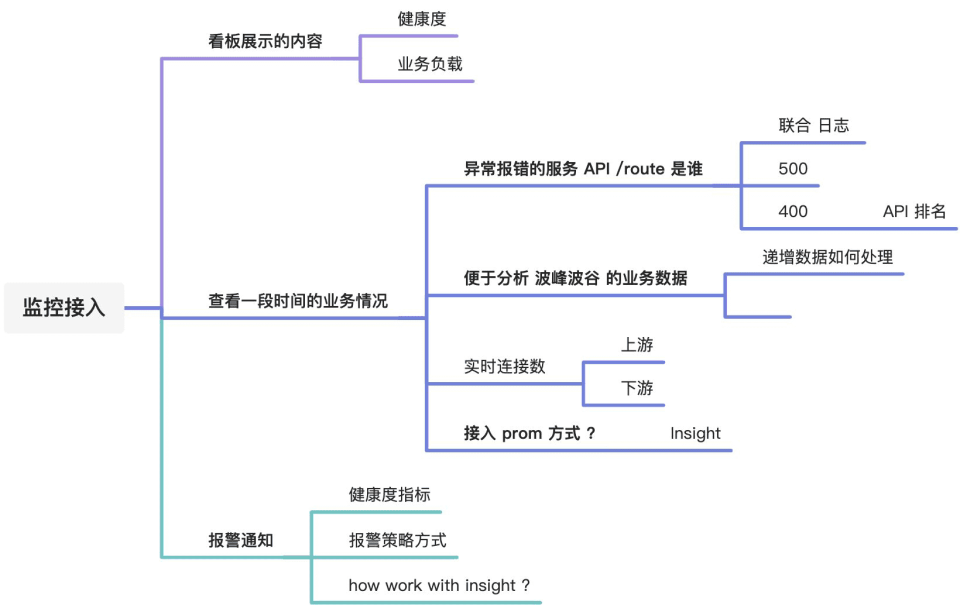

## Contour & Envoy 指标

本文档内容与Contour与 Envoy 的metrics相关, 据Contour与envoy的官网内容并参考源码、第三方blog等汇总而成. 因为 Contour 指标较少, 所以在文中全部列出,且个人主观的将其暂分为:必须与可选的； 在envoy中 metrics被称为stats 通过管理接口向公众暴露,因其指标过多,所以按官方建议只选取Cluster与HCM相关指标,并只抽取个人认为比较重要且现阶段需要的指标列出,如需要相看详情,请点击相应链接.

## Contour 指标

| Required | Name | Type | Description |  |
| --- | --- | --- | --- | --- |
| YES | contour\_build\_info | Gauge | branch, revision, version |  |
| NO | contour\_cachehandler\_onupdate\_duration\_seconds | Summary | Histogram for the runtime of xDS cache regeneration. |  |
| YES | contour\_dagrebuild\_timestamp | Gauge | Timestamp of the last DAG rebuild. |  |
| NO | contour\_dagrebuild\_total | Counter | Total number of times DAG has been rebuilt since startup |  |
| YES | contour\_eventhandler\_operation\_total | Counter | Total number of Kubernetes object changes Contour has received by operation and object kind. |  |
| YES | contour\_httpproxy | Gauge | Total number of HTTPProxies that exist regardless of status. |  |
| NO | contour\_httpproxy\_invalid | Gauge | Total number of invalid HTTPProxies. |  |
| NO | contour\_httpproxy\_orphaned | Gauge | Total number of orphaned HTTPProxies which have no root delegating to them. |  |
| YES | contour\_httpproxy\_root | Gauge | Total number of root HTTPProxies. Note there will only be a single |&#x20;
&#x20;|
| YES | contour\_httpproxy\_valid | Gauge | Total number of valid HTTPProxies. |  |

## Envoy 指标

### [Cluster](https://www.envoyproxy.io/docs/envoy/latest/configuration/upstream/cluster_manager/cluster_stats#config-cluster-manager-cluster-stats)

### General

| Name | Type | Description |
| --- | --- | --- |
| cluster\_added/modified/removed/updated | Counter | Total clusters added / modified / removed / updated |
| active\_clusters | Gauge | Number of currently active (warmed) clusters |
| upstream\_cx\_total | Counter | Total connections |
| upstream\_cx\_active | Gauge | Total active connections |
| upstream\_cx\_connect\_fail | Counter | Total connection failures |
| upstream\_cx\_connect\_timeout | Counter | Total connection connect timeouts |
| upstream\_cx\_connect\_ms | Histogram | Connection establishment milliseconds |
| upstream\_cx\_rx\_bytes\_total | Counter | Total received connection bytes |
| upstream\_cx\_tx\_bytes\_total | Counter | Total sent connection bytes |
| upstream\_rq\_total | Counter | Total requests |
| upstream\_rq\_active Gauge | Total | active requests |
| upstream\_rq\_timeout | Counter | Total requests that timed out waiting for a response |
| upstream\_rq\_retry | Counter | Total request retries |
| upstream\_rq\_retry\_success | Counter | Total request retry successes |

### Request Response Size statistics

| Name | Type | Description |
| --- | --- | --- |
| upstream\_rq\_headers\_size | Histogram | Request headers size in bytes per upstream |
| upstream\_rq\_body\_size | Histogram | Request body size in bytes per upstream |
| upstream\_rs\_headers\_size | Histogram | Response headers size in bytes per upstream |
| upstream\_rs\_body\_size | Histogram | Response body size in bytes per upstream |

### [HCM](https://www.envoyproxy.io/docs/envoy/latest/configuration/http/http_conn_man/stats#statistics)

### [General](https://www.envoyproxy.io/docs/envoy/latest/configuration/http/http_conn_man/stats#statistics)

| Name | Type | Description |
| --- | --- | --- |
| downstream\_cx\_total | Counter | Total connections |
| downstream\_cx\_active | Gauge | Total active connections |
| downstream\_cx\_rx\_bytes\_total | Counter | Total bytes received |
| downstream\_cx\_tx\_bytes\_total | Counter | Total bytes sent |
| downstream\_rq\_total | Counter | Total requests |
| downstream\_rq\_active | Gauge | Total active requests |
| downstream\_rq\_1/2/3/4/5xx | Counter | Total 1/2/3/4/5xx responses |
| downstream\_rq\_completed | Counter | Total requests that resulted in a response (e.g. does not include aborted requests) |
| downstream\_rq\_time | Histogram | Total time for request and response (milliseconds) |

### [Per user agent statistics](https://www.envoyproxy.io/docs/envoy/latest/configuration/http/http_conn_man/stats#per-user-agent-statistics)

| Name | Type | Description |
| --- | --- | --- |
| downstream\_cx\_total | Counter | Total connections |
| downstream\_rq\_total | Counter | Total requests |

### [HTTP per listener statistics¶](https://www.envoyproxy.io/docs/envoy/latest/configuration/http/http_conn_man/stats#http-per-listener-statistics)

| Name | Type | Description |
| --- | --- | --- |
| downstream\_rq\_completed | Counter | Total responses |
| downstream\_rq\_1/2/3/4/5xx | Counter | Total 1/2/3/4/5xx responses |

### [Tracing statistics](https://www.envoyproxy.io/docs/envoy/latest/configuration/http/http_conn_man/stats#tracing-statistics)

| Name | Type | Description |
| --- | --- | --- |
| random\_sampling | Counter | Total number of traceable decisions by random sampling |
| service\_forced | Counter | Total number of traceable decisions by server runtime flag tracing.global\_enabled |
| client\_enabled | Counter | Total number of traceable decisions by request header x-envoy-force-trace |
| not\_traceable | Counter | Total number of non-traceable decisions by request id |
| health\_check | Counter | Total number of non-traceable decisions by health check |

## 参考

- [Collecting Metrics with Prometheus](https://projectcontour.io/guides/prometheus/)
- [Cluster Stats](https://www.envoyproxy.io/docs/envoy/latest/configuration/upstream/cluster_manager/cluster_stats#config-cluster-manager-cluster-stats)
- [HTTP Stats](https://www.envoyproxy.io/docs/envoy/latest/configuration/http/http_conn_man/stats#statistics)
- [Counter](https://prometheus.io/docs/concepts/metric_types/#Counter)
- [Gauge](https://prometheus.io/docs/concepts/metric_types/#Gauge)
- [Summary](https://prometheus.io/docs/concepts/metric_types/#Summary)

***

关于监控指标的问题答疑：

- 实时 启动之后一直有的
- 时间范围的数据
- 数据统计维度
  - contour httpproxy count
  - envoy request count
  - httpproxy -> route -> request info summary
- 现阶段暂时未接入 prom，需要考虑如何处理，接入后会联动到 grafana，这部分跟 insight 怎么处理
- 告警怎么做？拿到了数据指标之后怎么处理

