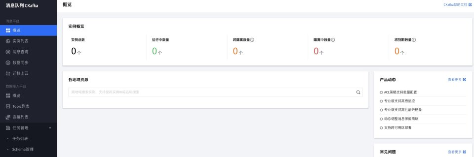
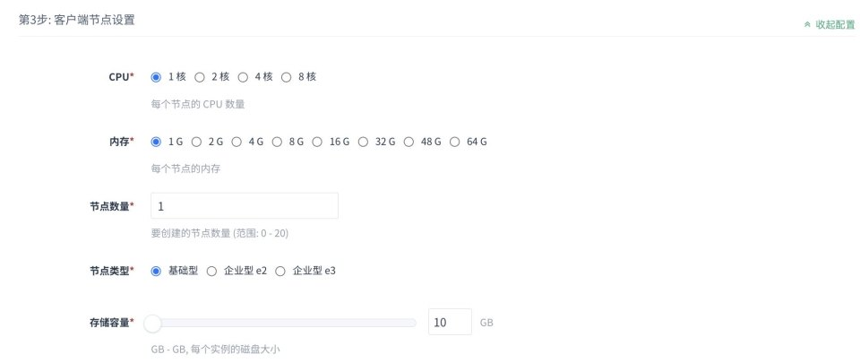

## 调研对象

| 厂家 | 产品控制台主页 | 应用模式 |
| --- | --- | --- |
| 阿里云 | [https://kafka.console.aliyun.com/](https://kafka.console.aliyun.com/) | 中间件 PaaS 模块之一 |
| 腾讯云 | [https://console.cloud.tencent.com/ckafka/overview](https://console.cloud.tencent.com/ckafka/overview) | 中间件 PaaS 模块之一 |
| 华为云 | [https://console.huaweicloud.com/dms/?region=cn-east-3&engine=kafka](https://console.huaweicloud.com/dms/?region=cn-east-3&engine=kafka) | 中间件 PaaS 模块之一 |
| QingCloud | [https://console.qingcloud.com/pek3/app/app-n9ro0xcp/](https://console.qingcloud.com/pek3/app/app-n9ro0xcp/) | 中间件 AppCenter 模块之一 |
| UCloud | [https://console.ucloud.cn/ukafka/ukafka](https://console.ucloud.cn/ukafka/ukafka) | 中间件 PaaS 模块之一 |
| 时速云 | [https://console.tenxcloud.com/middleware_center/app](https://console.tenxcloud.com/middleware_center/app) | 中间件 应用之一 |

## operator 选型

- [https://github.com/strimzi/strimzi-kafka-operator](https://github.com/strimzi/strimzi-kafka-operator)
- [https://github.com/banzaicloud/koperator](https://github.com/banzaicloud/koperator)

### 功能横向对比

| 功能点 | 阿里云 | 腾讯云 | 华为云 | QingCloud | UCloud | 时速云 | strimzi-kafka-operator | koperator |
| --- | --- | --- | --- | --- | --- | --- | --- | --- |
| Kafka 实例的生命周期管理 | √ | √ | √ | √ | √ | √ | √  | √  |
| Kafka 多版本支持 | √ 默认固定，工单调整 | √ | √ | √(仅 1 个) | √ | √ | √  | √  |
| Kafka 节点列表 | √ |  | √ |  | √ | 跳转 Pod | √ (能创建 pod) | √  |
| Kafka 原生参数管理 |&#x20;
&#x20;|  | √ | √ 原生 | √ | √ 原生 | √  | √  |
|  Kafka 常用参数抽象 | √ | √ | √ |  | √ |  | √  | √  |
| Kafka 模块自带 Zookeeper | √ | √ | √ |  | √ |  | √ |&#x20;
&#x20;|
| 消息查询功能 | √ | √ | √ | √ 原生 |  | √ 原生 |  |  |
| 消息下载功能 | √(高级版） |  |&#x20;
&#x20;|  |  |  |  |  |
| Topic 管理列表 | √ | √ | √ | √ 原生 | √ | √ 原生 |&#x20;
&#x20;|  |
|  Topic 增删改查 | √ | √ | √ | √ 原生 | √ | √ 原生 |&#x20;
&#x20;|&#x20;
&#x20;|
|  Topic 高级参数支持 | √ | √ | √ | √ 原生 | √ | √ 原生 |&#x20;
&#x20;|&#x20;
&#x20;|
| Topic 详情 | √ | √ |&#x20;
&#x20;| √ 原生 | √ | √ 原生 | √  | √  |
| Consumer Group 列表 | √ | √ |  | √ 原生 |  | √ 原生 |  |  |
| Consumer Group 增删改查 | √ | √ |  | √ 原生 | √ | √ 原生 |  |  |
| 资源监控看板 | √ | √ |  | √ | √ | √ | √ grafana dashboard | √ grafana dashboard |
|  Kafka 业务数据监控 (消息量/积压/消费情况) | √ | √ | √ |  | √ | √Grafana | √ exporter+grafana | √  exporter+grafana |
| 示例接入代码 | √ | √ | √ |  |  |  |  |  |
| 消息发送测试窗口 | √ | √ | √ |  |  |  |  |  |
| Kafka 服务日志查看 |  |  |  |  |  |  |  |  |
| 操作审计日志查看 | √ | √ | √ |  |  |  |  |  |
| 提供 Kafka Manager UI |  |  |  | √ |  | √ |  |  |
| 提供 kafka export 备份功能 | √ | √ |  |  |  |  |  |  |
| 友好性帮助文档 | √ | √ | √ | √ | √ |  |  |  |
| 提供帮助用户迁入上云 | √ | √ | √ |  |  |  |  |  |

## Kafka 创建过程及开放参数

| 厂家      | 字段                                                         |
| --------- | ------------------------------------------------------------ |
| 阿里云    | 名称流量规格集群流量 = 业务流量 + 集群内副本复制流量，该规格实际业务读流量处理峰值为 50 MB/s，业务写流量处理峰值为 10 MB/s。磁盘容量数据默认 3 副本存储。实例规格为标准版时，如购买 300G 磁盘，实际存储业务的磁盘大小为 100G，其余 200G 为备份容量。实例规格为专业版时，如购买 300G 磁盘，实际存储业务的磁盘大小为 300G，额外赠送 600G 备份容量。消息保留最长时间是指在磁盘容量充足的情况下，消息的最长保留时间；在磁盘容量不足（即磁盘水位达到 85%）时，将提前删除旧的消息，以确保服务可用性；默认 72 小时，可选 24 小时 ～ 168 小时。最大消息大小，默认 1MB 边界值？标准版实例单条消息最大为 256KB，专业版实例单条消息最大为 10MB 且支持**下载**Topic 数量 |
| 腾讯云    | 名称 Kafka 版本实例规格配置存储容量消息保留时长               |
| 华为云    | 名称 Kafka 版本实例规格配置存储容量                           |
| QingCloud | 名称 Kafka 版本 Kafka 节点配置：CPU / 内存  / 节点数（规格）客户端节点配置：CPU / 内存  / 节点数（规格）Kafka-Manager / CLI）Zookeeper 实例存储容量自定义参数配置内部 Topic offset replicasKafka manager 认证 zabbix.agentkafka scale version |
| UCloud    | 名称 Kafka 版本实例规格配置 + 存储容量实例数 3`<`设定值`<`100 消息保留时长 |

## 基础设计问题

### 部署方式？

DCE5 支持多集群，Kafka 采用 operator 的方式部署，则需要先安装 Operator 模板到集群内

### 什么时间安装   Kafka-operator？

在用户创建 kafka 实例时，检测是否目标集群是否存在 kafka-operator，如果不存在则同步安装

> 什么时间移除 kafka-operator，默认情况下安装后不移除；交由 Kpanda 对集群释放时处理

### 如果支持 Kafka 多版本？

通过多版本 对应 多 Kafka-opeator 的方式，让用户进行多版本选择

### Operator 更新后，存量 Kafka 怎么办？

> 非必要需求，短期不支持

默认情况下更新了 operator 之后，不对存量做处理；后续可以做友好提示用户升级即可

## 调研对象主要功能截图

### 阿里云

#### 实例生命周期管理

> 实例创建

> 实例详情

#### Kafka Topic 管理

#### Kafka 消息查询

#### 监控告警页面

#### Topic 详情

#### Group 管理

#### Prom 监控

### 腾讯云

#### Kafka 实例生命周期管理

#### 消息查询功能

#### 数据同步任务

#### 迁移上云功能

#### Topic 管理

[https://cloud.tencent.com/document/product/597/73566](https://cloud.tencent.com/document/product/597/73566)

#### 查看 Topic 详情

#### 查看 Topic 生产端连接

#### 发送测试消息

#### Group 管理

### 华为云

#### 实例的创建

#### 实例基本信息

#### 实例配置修改

#### 创建 Topic

#### 监控

#### 示例代码

### QingCloud

#### Kafka 实例的创建

> 创建时，需要关联依赖服务 zookeeper

#### 实例详情

#### Topic 管理

提供了原生的 Kafka-manager 管理 UI
[https://docsv3.qingcloud.com/middware/kafka/manual/kafka_manager/kafka_manager_topic/](https://docsv3.qingcloud.com/middware/kafka/manual/kafka_manager/kafka_manager_topic/)

访问方式，以 openvpn 的方式接入到 VPC(需绑定入口公网 IP) 后，通过 client 内网地址访问

### UCloud

#### 创建实例

#### Kafka 实例详情

#### Kafka 节点的详情页面

#### kafka 自定义配置

#### Kafka 连接器

将上游 Kafka 数据传输到 HDFS 或者 es

#### 监控看板

#### 创建 Topic

### 时速云

#### 实例生命周期管理

- 需要提前安装 zookeeper
- 需要联系时速云管理员安装 kafka-cluster-operator
  - 到交付中心，找到 Operator Hub，选择 Kafka-cluster-operator 安装
  - 安装完成后，可通过 Yaml + 表单形式 创建 Kafka
- 提供 Kafka manger 原生 UI 控制台

#### Kafka 实例详情

提供原生的实例管理界面，进行配置更新等

#### Kafka 实例下节点信息

直接跳转到 K8s 容器组界面查看

#### Topic 管理

在 Kafka manger 原生 UI 控制台内管理，默认启用了控制台公网访问能力

#### 实例资源监控

基础 CPU、内存、网络、存储监控

#### Kafka 性能监控

接入 Grafana 提供一个 Dashboard 的，可以查看 Topics 的消息数，消费量，积压数

## 调研对象操作视频录制

操作视频已上传到 OneDrive 共享空间

[https://yongyu2000hotmailcom.sharepoint.cn/:f:/s/ndx/EuCYqMaXhdlPh411YVnihRQBmCbGLQ4BvU1QW_2DX7_uUQ?e=18NyTR](https://yongyu2000hotmailcom.sharepoint.cn/:f:/s/ndx/EuCYqMaXhdlPh411YVnihRQBmCbGLQ4BvU1QW_2DX7_uUQ?e=18NyTR)

> 腾讯云只可以按月份订购，所以没有录制视频。

## 选型确认

方案一：

- 中间件实例 LCM + 三方 UI 管理工具

实现：

- Kafka 实例 LCM
- Kafka Manage UI (三方)
- 监控三件套 (Insight) [只需要做实例级别]

方案比对：

- 现有 Opeator 不带 Kafka Manger，需要自行处理
- 不需要关心 Topic LCM
- 不需要做业务监控
- 沿用现有的 DCE 中间件的设计思路

方案二：

- 不增加三方 Kafka Manage UI

实现：

- Kafka 实例 LCM
- Topic LCM
- 监控三件套 (Insight) [需要做实例 + 业务监控]

方案对比：

- 现有 Operator 带有 Topic CR，可以用
- 需要做业务监控
- 需要做 Topic LCM
- 与其他中间件模块定义不一致（当前阶段）
