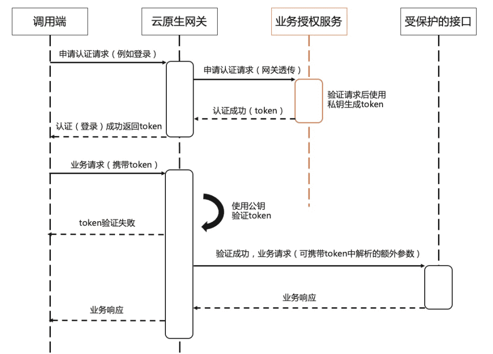

- 支持为 API 启用 jwt token 解码的能力 ,  读取网关的 jwt key
  - 读取请求 Header 中的 Authorization
- 需要支持为网关配置多 jwt key , and 加密长度 ?
  - 解密的性能问题
  - expire\_time 过期时间的配置
  - 解密后的参数传递

### 迭代的方向

1. 采用外置的 Jwt server 认证服务
   1. 配置 jwt server url
   2. respone 解密后的  json 内容；进行参数传递
2. 采用托管的 Jwt server 来进行托管
   1. 配置 jwt key (支持自动生成)
   2. expire\_time
   3. 加密长度
   4. 自动配置参数传递
      1. 全部传递
      2. 全部传递 (not token)
      3. 白名单传递
