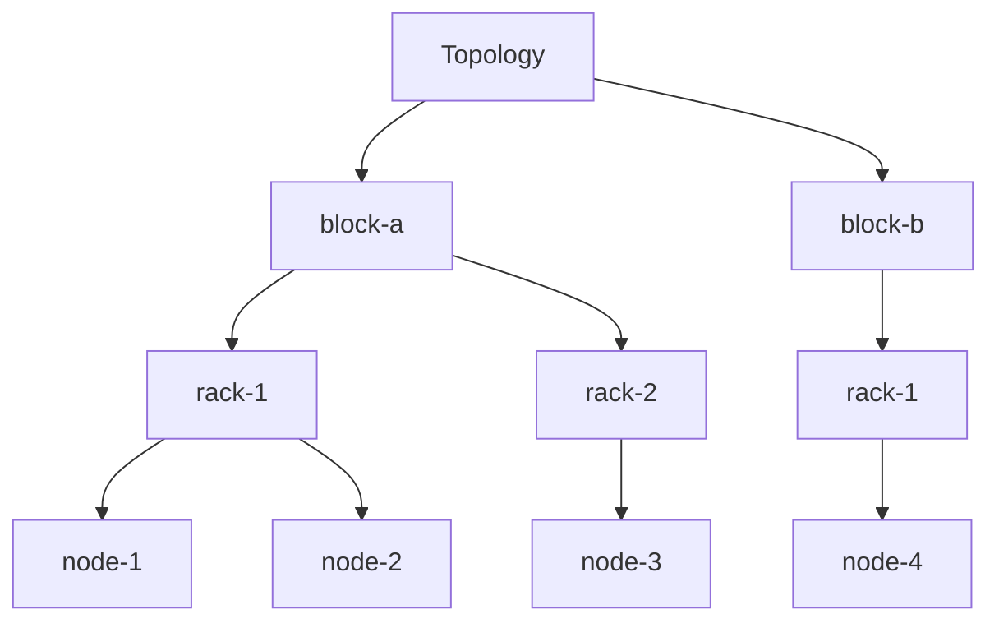

# 为 Kubernetes 节点打标签与绘制拓扑结构

本文档介绍如何为 Kubernetes 节点添加拓扑标签以支持 Kueue 的 Topology Aware Scheduling (TAS)，并提供拓扑结构的描述与可视化方法。标签基于三层拓扑结构：

- `cloud.provider.com/topology-block`：数据中心区块（block）
- `cloud.provider.com/topology-rack`：区块内的机架（rack）
- `kubernetes.io/hostname`：具体节点（hostname）

## 目录

- [为节点打标签](#为节点打标签)
  - [查看节点列表](#查看节点列表)
  - [添加拓扑标签](#添加拓扑标签)
  - [验证标签](#验证标签)
  - [创建 Topology CR](#创建-topology-cr)
  - [注意事项](#注意事项)
- [绘制拓扑结构](#绘制拓扑结构)
  - [文本形式拓扑结构](#文本形式拓扑结构)
  - [Mermaid 图表示例](#mermaid-图表示例)

## 为节点打标签

以下步骤展示如何为 Kubernetes 集群中的节点添加拓扑标签，假设集群包含多个节点，拓扑结构为：

- 区块：`block-a` 和 `block-b`
- 机架：每个区块包含 `rack-1` 和 `rack-2`
- 节点：由 `kubernetes.io/hostname` 标识

### 查看节点列表

使用 `kubectl` 查看集群中的节点：

```bash
kubectl get nodes
```

示例输出：

```
NAME       STATUS   ROLES    AGE   VERSION
node-1     Ready    <none>   10d   v1.29.0
node-2     Ready    <none>   10d   v1.29.0
node-3     Ready    <none>   10d   v1.29.0
node-4     Ready    <none>   10d   v1.29.0
```

### 添加拓扑标签

使用 `kubectl label` 为节点添加拓扑标签。以下为示例命令：

```bash
# 为 node-1 设置 block-a, rack-1
kubectl label nodes node-1 cloud.provider.com/topology-block=block-a
kubectl label nodes node-1 cloud.provider.com/topology-rack=rack-1

# 为 node-2 设置 block-a, rack-1
kubectl label nodes node-2 cloud.provider.com/topology-block=block-a
kubectl label nodes node-2 cloud.provider.com/topology-rack=rack-1

# 为 node-3 设置 block-a, rack-2
kubectl label nodes node-3 cloud.provider.com/topology-block=block-a
kubectl label nodes node-3 cloud.provider.com/topology-rack=rack-2

# 为 node-4 设置 block-b, rack-1
kubectl label nodes node-4 cloud.provider.com/topology-block=block-b
kubectl label nodes node-4 cloud.provider.com/topology-rack=rack-1
```

**说明**：

- `kubernetes.io/hostname` 由 Kubernetes 自动设置，无需手动添加，可通过以下命令验证：
  ```bash
  kubectl get nodes -o wide
  ```
- 若需修改现有标签，添加 `--overwrite` 参数：
  ```bash
  kubectl label nodes node-1 cloud.provider.com/topology-block=block-a --overwrite
  ```

### 验证标签

检查节点标签是否正确应用：

```bash
kubectl get nodes --show-labels
```

或使用自定义列查看拓扑标签：

```bash
kubectl get nodes -o custom-columns=NAME:.metadata.name,BLOCK:.metadata.labels['cloud\.provider\.com/topology-block'],RACK:.metadata.labels['cloud\.provider\.com/topology-rack'],HOSTNAME:.metadata.labels['kubernetes\.io/hostname']
```

示例输出：

```
NAME     BLOCK    RACK     HOSTNAME
node-1   block-a  rack-1   node-1
node-2   block-a  rack-1   node-2
node-3   block-a  rack-2   node-3
node-4   block-b  rack-1   node-4
```

### 创建 Topology CR

为 Kueue 配置 Topology CR 以识别拓扑结构。示例 YAML 文件：

```yaml
apiVersion: kueue.x-k8s.io/v1beta1
kind: Topology
metadata:
  name: default
spec:
  levels:
    - nodeLabel: "cloud.provider.com/topology-block"
    - nodeLabel: "cloud.provider.com/topology-rack"
    - nodeLabel: "kubernetes.io/hostname"
```

应用该 CR：

```bash
kubectl apply -f topology.yaml
```

### 注意事项

- 标签名称需符合 Kubernetes 标签规范，避免非法字符。
- 标签值（如 `block-a`、`rack-1`）可根据实际数据中心拓扑自定义。
- 在云提供商管理的集群（如 GKE、EKS）中，检查现有标签以避免冲突。

## 绘制拓扑结构

以下提供拓扑结构的文本描述和 Mermaid 图表示例。

### 文本形式拓扑结构

基于上述标签，拓扑结构如下：

```
Topology
├── block-a
│   ├── rack-1
│   │   ├── node-1
│   │   └── node-2
│   └── rack-2
│       └── node-3
└── block-b
    └── rack-1
        └── node-4
```

### Mermaid 图表示例

使用 Mermaid 语法绘制拓扑结构图：


