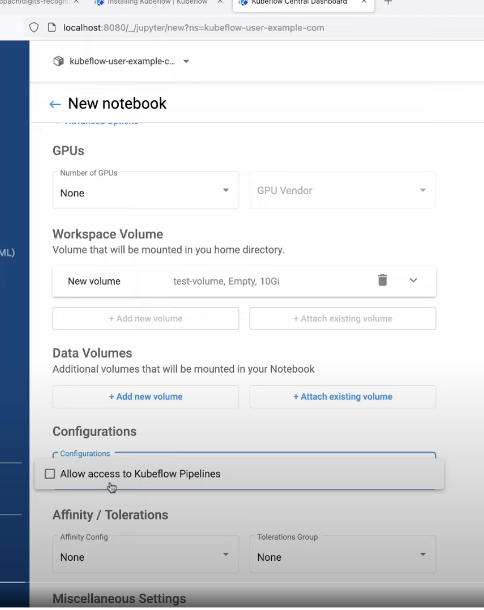

# Kubeflow 介绍

[www.youtube.com](https://www.youtube.com/watch?v=cTZArDgbIWw&list=PLIivdWyY5sqLS4lN75RPDEyBgTro_YX7x)


Kubeflow 操作视频:

https://www.youtube.com/watch?v=6wWdNg0GMV4



## 部署 training-operator

```bash
# kueue
export VERSION=v0.5.1
kubectl apply --server-side -f https://github.com/kubernetes-sigs/kueue/releases/download/$VERSION/manifests.yaml

# training-operator
kubectl apply -k "github.com/kubeflow/training-operator/manifests/overlays/standalone"
```

## Kueue 资源模板

### ResourceFlovar

```yaml
apiVersion: kueue.x-k8s.io/v1beta1
kind: ResourceFlavor
metadata:
  name: "default-flavor"
spec:
  nodeLabels:
    instance-type: spot
  nodeTaints:
  - effect: NoSchedule
    key: spot
    value: "true"
  tolerations:
  - key: "spot-taint"
    operator: "Exists"
    effect: "NoSchedule"
```

### ClusterQueue

```yaml
apiVersion: kueue.x-k8s.io/v1beta1
kind: ClusterQueue
metadata:
  name: "cluster-queue"
spec:
  namespaceSelector: {} # match all.
  resourceGroups:
  - coveredResources: ["cpu", "memory", "pods"]
    flavors:
    - name: "default-flavor"
      resources:
      - name: "cpu"
        nominalQuota: 9  
      - name: "memory"
        nominalQuota: 36Gi
      - name: "pods"
        nominalQuota: 5
```

```yaml
apiVersion: kueue.x-k8s.io/v1beta1
kind: ClusterQueue
metadata:
  name: "cluster-queue"
spec:
  namespaceSelector: {} # match all.
  resourceGroups:
  - coveredResources: ["cpu", "memory", "pods"]
    flavors:
    - name: "spot"
      resources:
      - name: "cpu"
        nominalQuota: 9
      - name: "memory"
        nominalQuota: 36Gi
      - name: "pods"
        nominalQuota: 50
    - name: "on-demand"
      resources:
      - name: "cpu"
        nominalQuota: 18
      - name: "memory"
        nominalQuota: 72Gi
      - name: "pods"
        nominalQuota: 100
  - coveredResources: ["gpu"]
    flavors:
    - name: "vendor1"
      resources:
      - name: "gpu"
        nominalQuota: 10
    - name: "vendor2"
      resources:
      - name: "gpu"
        nominalQuota: 10
```

namespaceSelector:

```yaml
namespaceSelector:
  matchExpressions:
  - key: team
    operator: In
    values:
    - team-a
```

### LocalQueue

```yaml
apiVersion: kueue.x-k8s.io/v1beta1
kind: LocalQueue
metadata:
  namespace: team-a 
  name: team-a-queue
spec:
  clusterQueue: cluster-queue
```

### WorkloadPriorityClass

```yaml
apiVersion: kueue.x-k8s.io/v1beta1
kind: WorkloadPriorityClass
metadata:
  name: sample-priority
value: 10000
description: "Sample priority"
```

## Training-operator 资源模板

### PytorchJob

```bash
kubectl create -f https://raw.githubusercontent.com/kubeflow/training-operator/master/examples/pytorch/simple.yaml
```

```yaml
apiVersion: "kubeflow.org/v1"
kind: PyTorchJob
metadata:
  name: pytorch-simple
  namespace: kubeflow
spec:
  pytorchReplicaSpecs:
    Master:
      replicas: 1
      restartPolicy: OnFailure
      template:
        spec:
          containers:
            - name: pytorch
              image: docker.io/kubeflowkatib/pytorch-mnist:v1beta1-45c5727
              imagePullPolicy: Always
              command:
                - "python3"
                - "/opt/pytorch-mnist/mnist.py"
                - "--epochs=1"
    Worker:
      replicas: 1
      restartPolicy: OnFailure
      template:
        spec:
          containers:
            - name: pytorch
              image: docker.io/kubeflowkatib/pytorch-mnist:v1beta1-45c5727
              imagePullPolicy: Always
              command:
                - "python3"
                - "/opt/pytorch-mnist/mnist.py"
                - "--epochs=1"
```

### TFJob

```yaml
apiVersion: kubeflow.org/v1
kind: TFJob
metadata:
  generateName: tfjob
  namespace: your-user-namespace
spec:
  tfReplicaSpecs:
    PS:
      replicas: 1
      restartPolicy: OnFailure
      template:
        metadata:
          annotations:
            sidecar.istio.io/inject: "false"
        spec:
          containers:
            - name: tensorflow
              image: gcr.io/your-project/your-image
              command:
                - python
                - -m
                - trainer.task
                - --batch_size=32
                - --training_steps=1000
    Worker:
      replicas: 3
      restartPolicy: OnFailure
      template:
        metadata:
          annotations:
            sidecar.istio.io/inject: "false"
        spec:
          containers:
            - name: tensorflow
              image: gcr.io/your-project/your-image
              command:
                - python
                - -m
                - trainer.task
                - --batch_size=32
                - --training_steps=1000
```

### PaddleJob

```yaml
apiVersion: "kubeflow.org/v1"
kind: PaddleJob
metadata:
  name: paddle-simple-cpu
  namespace: kubeflow
spec:
  paddleReplicaSpecs:
    Worker:
      replicas: 2
      restartPolicy: OnFailure
      template:
        spec:
          containers:
            - name: paddle
              image: registry.baidubce.com/paddlepaddle/paddle:2.4.0rc0-cpu
              command:
                - python
              args:
                - "-m"
                - paddle.distributed.launch
                - "run_check"
              ports:
                - containerPort: 37777
                  name: master
              imagePullPolicy: Always
```