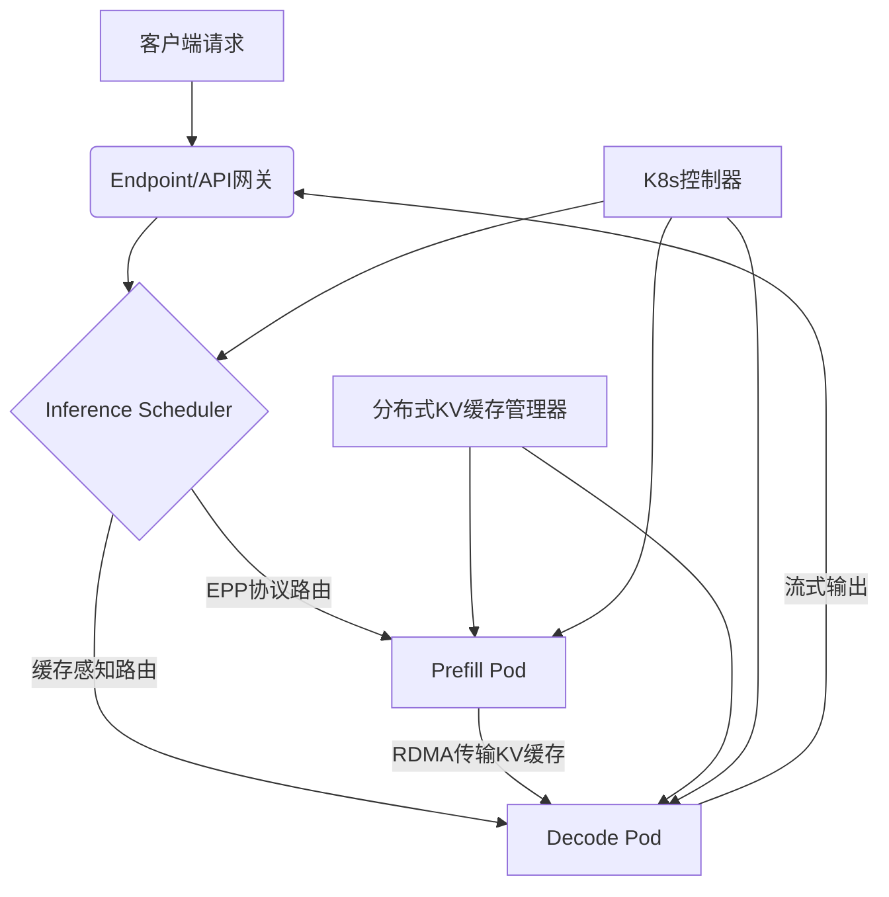

# LLM-D 项目介绍

## LLM-D 项目概述与背景

### 项目定位

LLM-D 是由红帽（Red Hat）联合 Google Cloud、NVIDIA、IBM Research 等科技巨头推出的 Kubernetes 原生分布式推理框架，旨在解决大规模生成式 AI 模型推理中的高成本、高延迟问题。其目标是将生产级 AI 推理能力标准化，推动其如 Linux 般普及。

### 核心问题与挑战

- 算力需求结构性转变：至 2028 年，80%以上算力将用于推理而非训练（Gartner 预测）。
- 集中式推理瓶颈：模型规模扩大导致资源需求激增，传统架构面临成本过高、延迟过长问题。
- 企业落地难点：需平衡性能（SLO）、成本（TCO）与异构环境兼容性。

## LLM-D 核心架构与技术特性

### 分层架构设计

### 关键技术组件

#### 推理调度器（Inference Scheduler）

- 动态任务分配：根据请求类型（Prefill/Decode）调用 EPP 协议（Endpoint Picker Protocol）选择最优节点。
- 资源感知调度：基于节点负载、KV 缓存命中率、硬件特性（GPU 算力/内存带宽）动态评分。
- 阶段解耦：分离计算密集型预填充（Prefill）与内存密集型解码（Decode），支持独立扩缩容。

#### 预填充与解码实例（Prefill/Decode Pod）

| 组件        | 功能                                    | 硬件优化方向                  |
| ----------- | --------------------------------------- | ----------------------------- |
| Prefill Pod | 处理完整提示词，生成首 Token 及 KV 缓存 | 高算力 GPU（如 H100）         |
| Decode Pod  | 基于 KV 缓存流式生成后续 Token          | 高内存带宽硬件（如 Groq LPU） |

协作机制：Prefill 生成 KV 缓存后，通过 RDMA/NVLink 毫秒级传输至 Decode 节点。

#### 分布式 KV 缓存管理

- 缓存卸载：将 GPU 显存中的 KV 缓存转移至成本更低的 CPU 内存或网络存储（如 LMCache）。
- 共享缓存方案：支持远程存储/全局索引，提升跨请求缓存复用率。

#### 端到端协议与路由

- EPP 协议（Endpoint Picker Protocol）：
  - 定制化负载均衡策略，替代传统轮询/随机路由。
    - 深度集成 Kubernetes，通过 kgateway 组件实现 AI 感知路由。
- 推理网关（Inference Gateway, IGW）：统一接入点，支持 OAI 兼容 API 及安全管控。

## 性能优化与创新技术

### 核心优化能力

| 技术                                    | 效果                                     | **适用场景**                      |
| --------------------------------------- | ---------------------------------------- | --------------------------------- |
| **P/D 分离**                            | 资源利用率提升 50%，吞吐量翻倍           | 输入输出令牌比高的任务（如 20:1） |
| **前缀缓存感知路由**                    | TTFT（首 Token 时间）降低 3 倍           | 高 SLO 要求的实时交互             |
| **变体自动扩缩（Variant Autoscaling）** | 按需伸缩 Prefill/Decode 组，成本降低 30% | 流量波动大的生产环境              |

### 支持异构硬件与网络

- 硬件适配：兼容 NVIDIA GPU、Google TPU、AMD/Intel 加速器。
- 网络优化：
  - 高性互联：支持 InfiniBand（IB）/RDMA 低延迟传输。
    - 数据中心网络：普通以太网优化路径。

## 部署实践与生态集成

### Kubernetes 原生集成

- 弹性扩缩容：基于 HPA 动态调整 Pod 数量，满足 SLO 前提下降本增效。
- 运维简化：通过 CRD 定义推理任务，与 OpenShift/RHEL 无缝兼容。

### 企业级功能支持

- 安全与治理：端到端加密、RBAC 权限管理、审计日志。
- 多模型/多云支持：支持 100+模型接入，无厂商锁定（Any Cloud, Any Model）。

### 生态合作与社区

- 核心贡献者：NVIDIA（Dynamo KV 缓存组件）、Google Cloud（TPU 支持）、IBM Research。
- 合作伙伴：Hugging Face（模型库）、英特尔（硬件优化）、Mistral AI（前沿模型支持）。

## 适用场景与竞品对比

### 典型应用场景

- 企业知识库：高并发 RAG 应用，通过 Dify 低代码平台快速集成。
- 边缘计算：LMDeploy 量化压缩（4-bit W4A16），显存占用降 70%。
- 本地轻量部署：Ollama 开箱即用，支持 Mac/Linux CPU 推理。

### 主流推理框架对比

| 框架          | 核心优势                              | 适用场景                      |
| ------------- | ------------------------------------- | ----------------------------- |
| LLM-D         | PD 解耦/分布式 KV 缓存/K8s 原生扩缩容 | 大规模企业级推理（1000+ QPS） |
| vLLM          | PagedAttention 高吞吐/连续批处理      | 中小规模高性能推理            |
| Tensor RT-LLM | NVIDIA GPU 深度优化/FP8 量化/超低延迟 | H100/A100 集群极致性能场景    |
| LMDeploy      | 量化压缩/国产芯片适配（寒武纪）       | 信创环境/边缘设备             |

## 总结与趋势展望

- 技术价值：LLM-D 通过 阶段解耦、缓存感知路由、云原生集成 三层次创新，实现推理延迟降 3 倍、吞吐提 50%~100%。
- 行业影响：推动 AI 推理从“集中式单点优化”转向“分布式标准化基建”，降低企业 TCO 40%+（红帽案例）。
- 未来方向：
  - 自动张量并行：动态切分超大模型参数，适配万卡集群。
    - 联邦推理：跨企业安全协作推理，保护数据隐私。

此文档系依据公开技术资料整理，红帽 LLM-D 项目官网提供完整代码与部署指南：

👉 https://github.com/llm-d/llm-d

## 附录：关键术语表

- TTFT（Time to First Token）：首 Token 生成延迟，衡量响应即时性。
- KV 缓存（Key-Value Cache）：存储注意力机制中间结果，加速自回归生成。
- EPP（Endpoint Picker Protocol）：智能负载均衡协议，实现动态路由。
