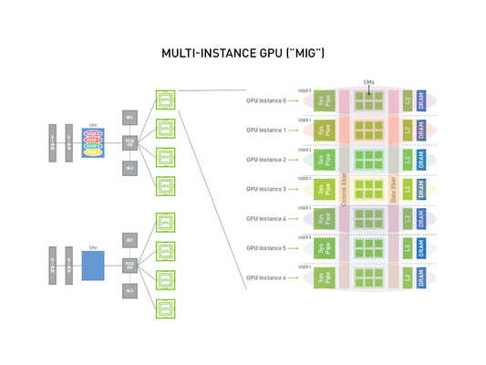

# Nvidia MIG

Multi-Instance GPU（MIG）功能使 NVIDIA A100 GPU 可以安全地切割為多達七個用於 CUDA 應用的獨立 GPU 實例，從而為多個用戶提供獨立的 GPU 資源，以優化 GPU 的利用率。此功能對於 GPU 工作負載利用率低的特別有用，因此使用 MIG 技術，可在單張 GPU 上並行運行不同的工作負載以最大化利用率。

目前只有 NVIDIA Tesla A100 及 A30 擁有這個功能。

### MIG 的功能和优势

1. **资源隔离**：MIG 技术确保每个实例都具有独立访问其分配资源的能力，这有助于提供一致的性能和预测性。
2. **硬件利用率提高**：通过将单个 GPU 分割成多个实例，组织可以更有效地利用硬件资源。这对于具有不同需求的多个小型工作负载尤其有用。
3. **灵活性和扩展性**：MIG 允许为不同的工作负载定制 GPU 资源，从而在需要的时候轻松扩展或减小实例。
4. **成本效益**：MIG 有助于降低总体硬件成本，因为可以将单个 GPU 用于多个用户或应用程序，而无需购买多个单独的 GPU。
5. **适用于各种工作负载**：无论是深度学习、科学计算还是数据分析等任务，MIG 都可以提供所需的灵活性和性能。
6. **与现有软件和工具集成**：MIG 可与现有的容器化解决方案和集群管理工具集成，使得在现有基础设施中部署和管理更加方便。
7. **增强安全性**：由于每个 GPU 实例都在硬件级别上进行隔离，因此 MIG 也有助于增强安全性和隔离不同用户或工作负载之间的潜在影响。

### 结论

总的来说，NVIDIA 的 MIG 技术提供了一种灵活、高效和安全的方法来满足现代数据中心的多样化需求。通过 GPU 的资源分隔和隔离，MIG 有助于实现更精细的资源控制，从而提高硬件的利用率和工作负载的性能。

### 参考资料

- https://roychou121.github.io/2020/10/29/nvidia-A100-MIG/
- https://zhuanlan.zhihu.com/p/558046644
- https://www.zhihu.com/column/c_1552001218175766528